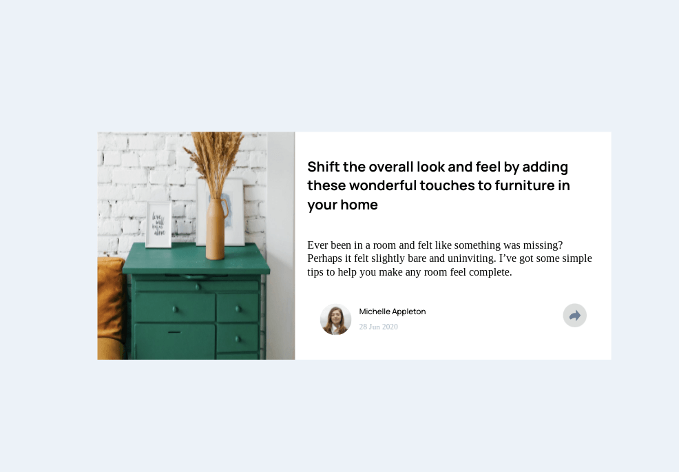
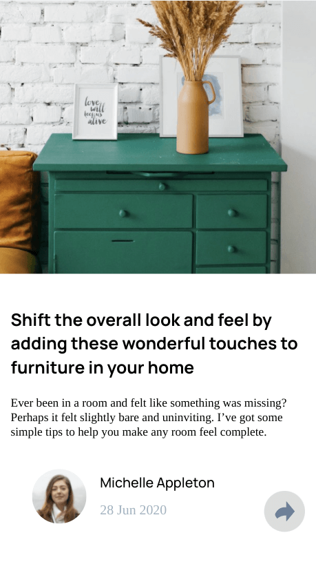
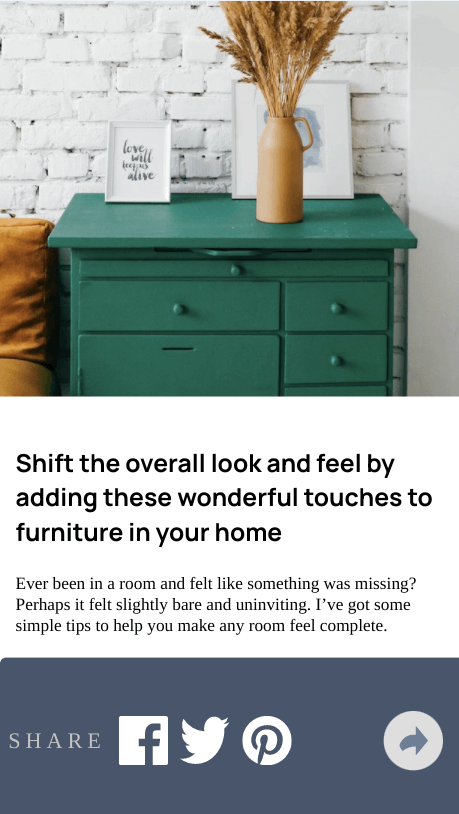

# Frontend Mentor - Article preview component solution

This is a solution to the [Article preview component challenge on Frontend Mentor](https://www.frontendmentor.io/challenges/article-preview-component-dYBN_pYFT). Frontend Mentor challenges help you improve your coding skills by building realistic projects. 

## Table of contents

- [Overview](#overview)
  - [The challenge](#the-challenge)
  - [Screenshot](#screenshot)
  - [Links](#links)
- [My process](#my-process)
  - [Built with](#built-with)
  - [What I learned](#what-i-learned)
  - [Continued development](#continued-development)
  - [Useful resources](#useful-resources)

## Overview

### The challenge

Users should be able to:

- View the optimal layout for the component depending on their device's screen size
- See the social media share links when they click the share icon

### Screenshot

### Links

- Live Site URL: [Github Pages](https://jdegand.github.io/article-preview-component/)

## My process

### Built with

- CSS custom properties
- Flexbox
- Mobile-first workflow

### What I learned

### Continued development

- Semantic HTML5 markup
- Replace import with link tag
- The Arrow is off
- Use svgs in the HTML
- Tooltip location varies per screen size

### Useful resources

- [W3 Schools](https://www.w3schools.com/css/css_tooltip.asp) - Tooltips
- [CSS Tricks](https://css-tricks.com/scale-svg/) - scale svg
